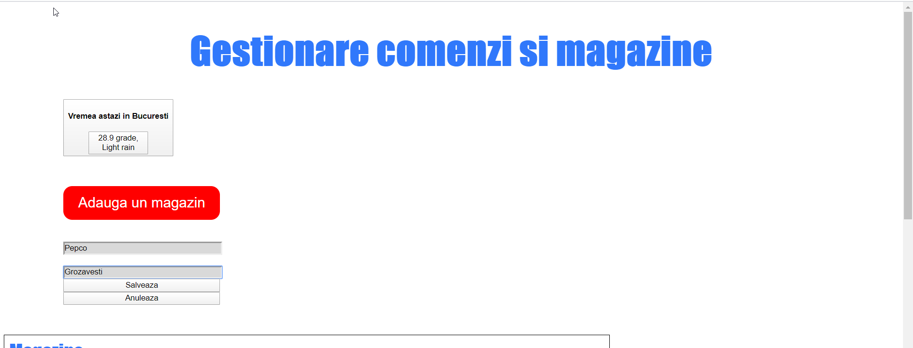
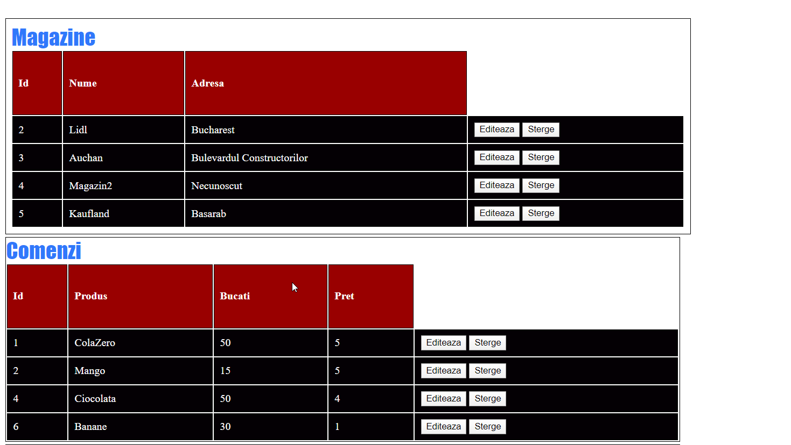
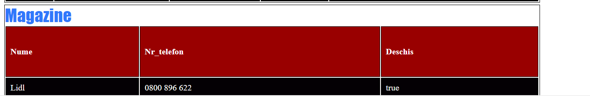
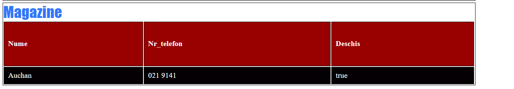

# APLICATIE GESTIONARE MAGAZINE SI COMENZI

## INTRODUCERE
Aceasta aplicatie are scopul de a gestiona datele despre magazinele partenere ale unei companii furnizoare de produse, dar si comenzile pe care aceasta
trebuie sa le indeplineasca. Aplicatia integreaza doua API-uri: Weatherbit care ofera informatii despre vreme
in ziua respectiva si Google Places care ofera informatii despre magazine, mai exact un numar de contact
si daca in momentul accesarii site-ului web magazinul este deschis sau nu.

## Descriere problema
Aceasta aplicatie web vine in ajutorul furnizorilor care lucreaza in diverse companii si trebuie sa livreze marfa catre
anumite magazine. Ea pune la dispozitie date in timp real despre adresa si produsele care trebuie livrate(extrase din baza de date a fiecarui utilizator) si date despre
vremea in momentul accesarii, numarul de contact al magazinului si daca este deschis sau nu.
Toate aceste informatii pot fi accesate, avand doar o conexiune la internet si un dispozitiv care sa
acceseze site-ul web.
Problema de la care am plecat a fost necesitatea acestor furnizori de a avea stocate intr-un singur loc
informatiile necesare livrarii produselor.

## Descriere API
#### Google Places
Unul dintre API-urile integrate este Google Places. Pe baza unui place_id corespunzator fiecarei locatii
poti obtine diverse informatii, cum ar fi adresa completa, numarul de telefon, rating, review, orele de functionare etc.
Raspunsul poate fi returnat atat sub forma xml, cat si json. Exista mai multe tipuri de requests ce se pot face, unele
care returneaza locuri pe baza unei locatii, altele returneaza poze din anumite locatii, altele detalii.
Tipul de request folosit in aceasta aplicatie este Place Details. Fiecare este accesat printr-o metoda HTTP si include un API key care este asociat unui proiect din platforma Google Cloud.

#### Weather bit
Acest API returnează condițiile meteo actuale dintr-o rețea cu peste 45.000 de stații
meteorologice care raporteaza la fiecare ora date. 
Fiecare solicitare API va returna cea mai recenta observație si din cea mai apropiata statie de locul pentru care se face requestul.
Toti parametri pt request trebuie furnizati sub forma de siruri de caracter. Se pot obtine informatii pe baza numelui unui oras, coordonatelor, codului postal, unui id unic.
Totodata se pot obtine date pentru o lista de orase. Toate acestea necesita un API key obtinut foarte usor prin crearea unui cont pe platforma.
Singura metoda http suportata este GET. Raspunsurile sunt date sub forma Json si contin informatii
despre timezone, data curenta, informatii meteo despre vant, temperatura, o scurta descriere, nori, vizibilitate, precipitatii etc.

## Flux de date
In cadrul aplicatiei am folosit mai multe metode http pentru cereri la propria baza de date:
* GET - aduce informatii despre magazine si comenzi
* PUT - poti edita detaliile stocate in baza de date despre un magazin
* POST - poti adauga un magazin si detaliile corespunzatoare
* DELETE - poti sterge atat un magazin, cat si o comanda

In cadrul integrarii API -urilor am folosit ca metode http:
* GET - aduce informatii despre vreme (Weather bit), dar si despre locatii (Google Places)
##### Exemple de request/response:
- request Google Places: 'https://maps.googleapis.com/maps/api/place/details/json?place_id=ChIJdZ_LIZIBskARMk-QagpmZc4&fields=name,rating,opening_hours,formatted_phone_number&key='
response: 
```json 
{
   "html_attributions" : [],
   "result" : {
      "formatted_phone_number" : "0800 896 622",
      "name" : "Lidl",
      "opening_hours" : {
         "open_now" : true,
         "periods" : [
            {
               "close" : {
                  "day" : 0,
                  "time" : "1830"
               },
               "open" : {
                  "day" : 0,
                  "time" : "0900"
               }
            },
            {
               "close" : {
                  "day" : 1,
                  "time" : "2100"
               },
               "open" : {
                  "day" : 1,
                  "time" : "0730"
               }
            },
            {
               "close" : {
                  "day" : 2,
                  "time" : "2100"
               },
               "open" : {
                  "day" : 2,
                  "time" : "0730"
               }
            },
            {
               "close" : {
                  "day" : 3,
                  "time" : "2100"
               },
               "open" : {
                  "day" : 3,
                  "time" : "0730"
               }
            },
            {
               "close" : {
                  "day" : 4,
                  "time" : "2100"
               },
               "open" : {
                  "day" : 4,
                  "time" : "0730"
               }
            },
            {
               "close" : {
                  "day" : 5,
                  "time" : "2100"
               },
               "open" : {
                  "day" : 5,
                  "time" : "0730"
               }
            },
            {
               "close" : {
                  "day" : 6,
                  "time" : "2100"
               },
               "open" : {
                  "day" : 6,
                  "time" : "0730"
               }
            }
         ],
         "weekday_text" : [
            "Monday: 7:30 AM – 9:00 PM",
            "Tuesday: 7:30 AM – 9:00 PM",
            "Wednesday: 7:30 AM – 9:00 PM",
            "Thursday: 7:30 AM – 9:00 PM",
            "Friday: 7:30 AM – 9:00 PM",
            "Saturday: 7:30 AM – 9:00 PM",
            "Sunday: 9:00 AM – 6:30 PM"
         ]
      },
      "rating" : 4.1
   },
   "status" : "OK" 
   ``` 
- request Weather bit: https://api.weatherbit.io/v2.0/current?city=Bucharest&key=2ac00cd7258e4c0db91ff1d38be1b959

response:
``` json
{"data":[{"rh":31,"pod":"d","lon":26.10626,"pres":994.8,"timezone":"Europe\/Bucharest","ob_time":"2020-05-12 14:35","country_code":"RO","clouds":100,"ts":1589294100,"solar_rad":114.1,"state_code":"10","city_name":"Bucharest","wind_spd":1,"last_ob_time":"2020-05-12T14:35:00","wind_cdir_full":"north","wind_cdir":"N","slp":1004.3,"vis":1.5,"h_angle":45,"sunset":"17:33","dni":809.7,"dewpt":11,"snow":0,"uv":6.17284,"precip":3.15789,"wind_dir":0,"sunrise":"02:50","ghi":570.38,"dhi":99.67,"aqi":67,"lat":44.43225,"weather":{"icon":"r01d","code":"500","description":"Light rain"},"datetime":"2020-05-12:14","temp":30,"station":"AU800","elev_angle":36.1,"app_temp":28.9}],"count":1}
```


##### Autentificare:
Metodele de autentificare folosite pentru ambele API-uri se bazeaza pe un API key, care este asociat unui cont pe fiecare platforma.

La Google Places - API key este chiar asociat unui proiect.

## Capturi ecran aplicatie
Adauga magazin



Magazine si comenzi


Informatii magazine




<<<<<<< HEAD
=======

>>>>>>> acf09b7797d9332abbcbd6d8cf606b6c1fb4c490
